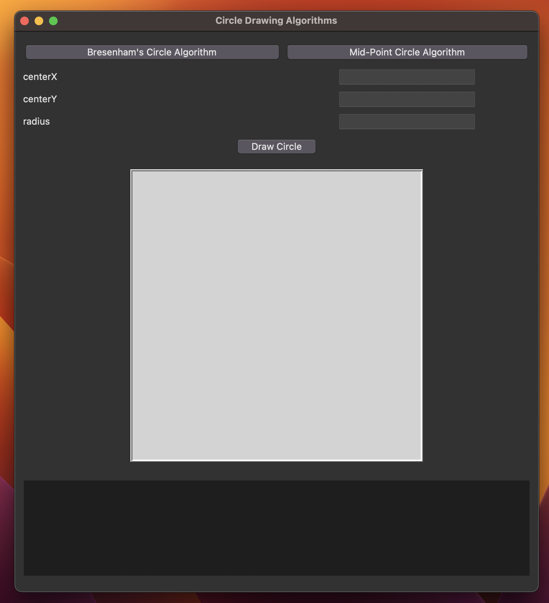
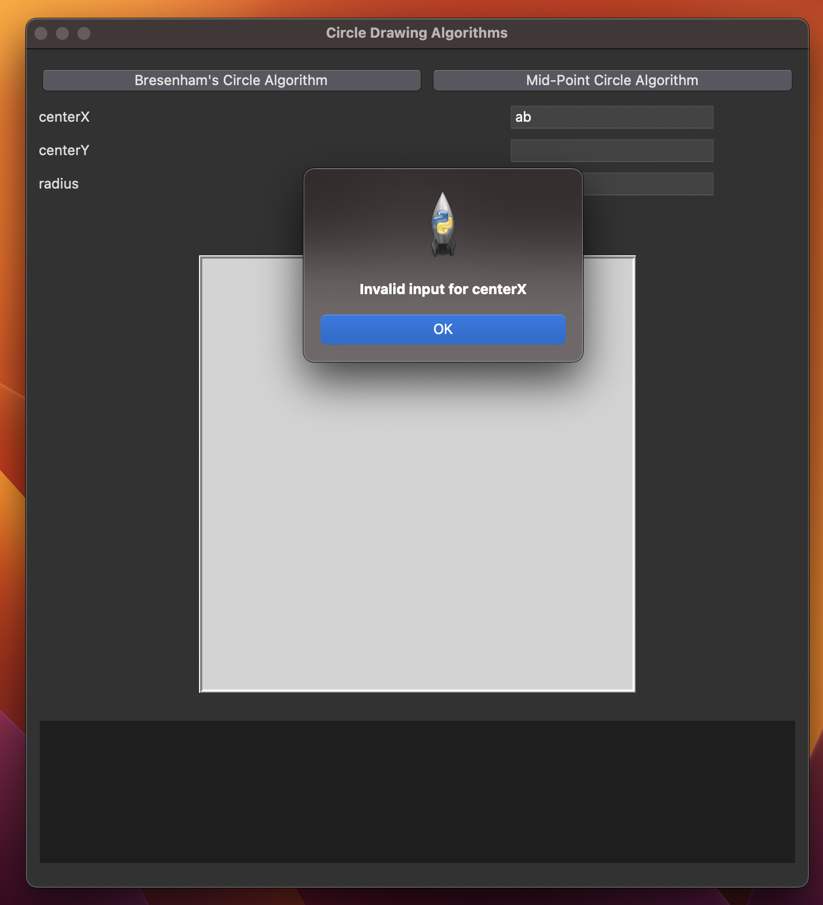
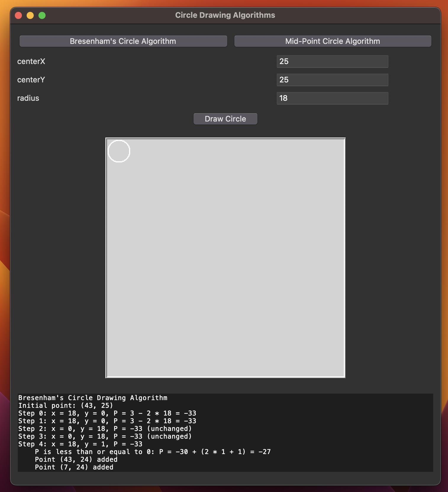
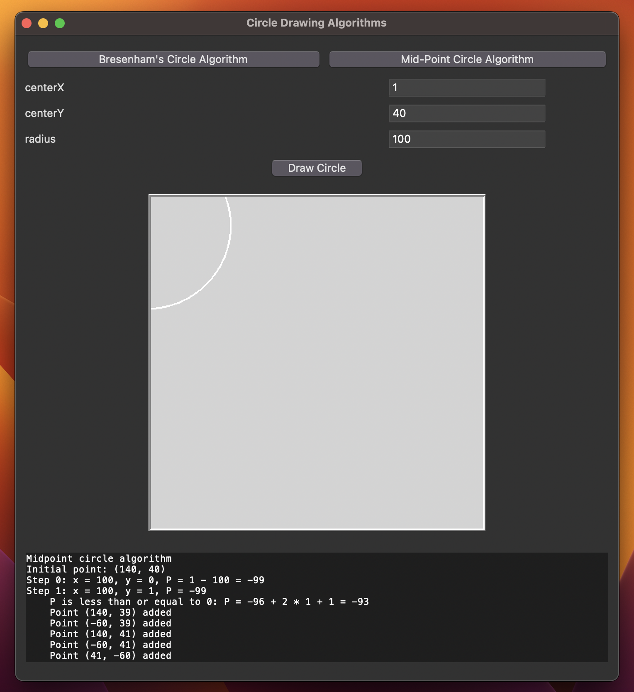

# Computer Graphics

Professor: Dr. Deepak Kumar Singh

Course: Computer Graphics

Program: B.Tech

Name: Karthik S

Roll No: LIT2021012

## Lab Assignment 1 : Line Drawing Algorithms

This lab assignment focuses on the implementation and visualization of two popular line drawing algorithms: DDA (Digital Differential Analyzer) and Bresenham's Algorithm. The assignment provides a Python GUI application that allows users to draw lines using these algorithms interactively.

### Implementation

The assignment consists of a Python application built using the tkinter library for the graphical user interface.

Here's an overview of the key components and functionality:

- **App Class**: This class represents the main application and serves as the GUI frontend. It includes buttons for selecting the drawing algorithm (DDA or Bresenham), input fields for specifying line coordinates, a canvas for drawing and a log display for calculation logs

- **DDA Algorithm**: The DDA line drawing algorithm is implemented in the `dda_algorithm` function. It calculates and logs the points along the line and the relevant calculations

- **Bresenham Algorithm**: The Bresenham line drawing algorithm is implemented in the `bresenham_algorithm` function. Similar to DDA, it calculates and logs the points along the line, as well as the decision parameter at each step

- **Logging**: Calculation logs for both algorithms are displayed on the GUI. This includes details such as the values of dx, dy, slope, steps, Xinc, Yinc and the decision parameters at each point

- **Error Handling**: The application validates user input to ensure that it consists of valid integer values for coordinates. It displays an error message if invalid input is detected

### How to Use

1. Launch the application
2. Select the drawing algorithm (DDA or Bresenham) by clicking the respective buttons
3. Input the starting and ending coordinates of the line in the provided entry fields
4. Click the "Submit" button to execute the selected algorithm and draw the line
5. View the calculation logs displayed on the GUI

### Algorithms

#### DDA Algorithm

##### Algorithm

```c
Algorithm: DDA Line Drawing

Input:
- (Xstart, Ystart): Starting point coordinates
- (Xend, Yend): Ending point coordinates
- Desired Color: The color of the line

Output:
- Draws a line from (Xstart, Ystart) to (Xend, Yend)

// Calculate the slope (m) of the line
m = (Yend - Ystart) / (Xend - Xstart)

// Check if the absolute value of the slope is greater than 1 and if Ystart is greater than Yend
if (abs(m) > 1) and (Ystart > Yend):
    // Swap endpoints (Xstart, Ystart) and (Xend, Yend)
    Swap(Xstart, Xend)
    Swap(Ystart, Yend)

// Initialize the current point (X, Y) to (Xstart, Ystart)
X = Xstart
Y = Ystart

// Set the pixel at (X, Y) to the desired color
SetPixel(X, Y, DesiredColor)

// Check if the absolute value of the slope is greater than 1
if (abs(m) > 1):
    // Calculate the reciprocal of the slope
    m = 1 / m
    // Move to the next row
    Y = Y + 1

// Iteratively draw the line by incrementing X and calculating Y
while (Y <= Yend - 1):
    // Calculate the next X-coordinate
    X = X + m
    // Round the X-coordinate to the nearest integer
    RoundedX = Round(X)
    // Set the pixel at (RoundedX, Y) to the desired color
    SetPixel(RoundedX, Y, DesiredColor)
    // Move to the next row
    Y = Y + 1

// Set the pixel at (Xend, Yend) to the desired color
SetPixel(Xend, Yend, DesiredColor)
```

##### Code Implementation

```python
def dda_algorithm(startX, startY, endX, endY):
    points = []

    dx = endX - startX
    dy = endY - startY

    steps = max(abs(dx), abs(dy))

    Xinc = dx / float(steps)
    Yinc = dy / float(steps)

    x, y = startX, startY
    points.append((x, y))

    for _ in range(steps):
        x += Xinc
        y += Yinc
        points.append((round(x), round(y)))

    return points
```

#### Bresenham Algorithm

##### Algorithm

```c
Algorithm: Bresenham Line Drawing

Input:
- (Xstart, Ystart): Starting point coordinates
- (Xend, Yend): Ending point coordinates
- Desired Color: The color of the line

Output:
- Draws a line from (Xstart, Ystart) to (Xend, Yend)

// Store the left endpoint in (x0, y0)
x0 = Xstart
y0 = Ystart

// Initialize the constants Δx, Δy, 2Δy, and (2Δy - 2Δx)
Δx = abs(x1 - x0)
Δy = abs(y1 - y0)

2Δy = 2 * Δy
2Δy - 2Δx = 2 * Δy - 2 * Δx

// Calculate the initial decision parameter P0
P0 = 2Δy - Δx

// Plot the first point at (x0, y0)
PlotPoint(x0, y0)

// Initialize variables
x = x0
y = y0
P = P0

// Iterate through x along the line
for k = 1 to Δx:
    // Check the decision parameter P
    if P < 0:
        // Choose the next point as (xk+1, yk)
        x = x + 1
        P = P + twoΔy
    else:
        // Choose the next point as (xk+1, yk+1)
        x = x + 1
        y = y + 1
        P = P + twoΔyMinus2Δx

    // Plot the point at (x, y)
    PlotPoint(x, y)
```

##### Code Implementation

```python
def bresenham_algorithm(startX, startY, endX, endY):
    points = []

    dx = endX - startX
    dy = endY - startY

    x, y = startX, startY
    points.append((x, y))

    if abs(dx) > abs(dy):
        steps = abs(dx)
    else:
        steps = abs(dy)

    Xinc = dx / float(steps)
    Yinc = dy / float(steps)

    p = 2 * abs(dy) - abs(dx)

    for _ in range(steps):
        if p < 0:
            p += 2 * abs(dy)
        else:
            p += 2 * abs(dy) - 2 * abs(dx)
            y += Yinc
        x += Xinc
        points.append((round(x), round(y)))

    return points
```

### Screenshots

#### Base Line Drawing


#### Validation


#### DDA Algorithm


#### Bresenham Algorithm


## Lab Assignment 2 : Circ;e Drawing Algorithms

The aim of this lab is to implement and compare two popular algorithms for drawing circles - Bresenham's Algorithm and Midpoint Algorithm. This involves understanding the theory behind these algorithms, coding them, and evaluating their performance

### Implementation

The assignment consists of a Python application built using the tkinter library for the graphical user interface

Here's an overview of the key components and functionality:

- **App Class**: This class represents the main application and serves as the GUI frontend. It contains UI elements for selecting the circle drawing algorithm (Bresenham’s or Midpoint), input fields, a canvas for drawing and a log display for calculation logs

- **Bresenham Algorithm**: The Bresenham’s circle drawing algorithm is implemented in the `bresenham_algorithm` function

- **Mid-Point Algorithm**: The Midpoint circle drawing algorithm is implemented in the `midpoint_circle_algorithm` function

- **Logging**: Detailed calculation logs for both algorithms are displayed on the GUI

- **Error Handling**: The application validates user input to ensure that it consists of valid integer values for coordinates. It displays an error message if invalid input is detected

### How to Use

1. Launch the application
2. Select the drawing algorithm by clicking the respective buttons
3. Input the center coordinates and radius of the circle in the provided entry fields
   circle
4. View the calculation logs displayed on the GUI

### Algorithms

#### Bresenham's Algorithm

##### Algorithm

```c
Algorithm: Bresenham circle drawing Algorithm

Input:
- (Xc, Yc): Center coordinates of the circle
- R: Radius of the circle
- Desired Color: The color of the line


Output:
- Draws a circle with center at (Xc, Yc) and the specified radius


Initialize X and Y to 0.
Calculate the initial decision parameter:
    P = 3 - 2 * R


For each point (X, Y), do the following:
    SetPixel(Xc + X, Yc + Y, DesiredColor)
    SetPixel(Xc - X, Yc + Y, DesiredColor)
    SetPixel(Xc + X, Yc - Y, DesiredColor)
    SetPixel(Xc - X, Yc - Y, DesiredColor)
    SetPixel(Xc + Y, Yc + X, DesiredColor)
    SetPixel(Xc - Y, Yc + X, DesiredColor)
    SetPixel(Xc + Y, Yc - X, DesiredColor)
    SetPixel(Xc - Y, Yc - X, DesiredColor)


If P is less than 0, increment X and update P as follows:
    P = P + 4 * X + 6
If P is greater than or equal to 0, increment X and decrement Y, then update P as follows:
    P = P + 4 * (X - Y) + 10
```

##### Code Implementation

```python
def bresenham_circle_algorithm(x_center, y_center, radius):
    x = radius
    y = 0
    points = []
    logs = []

    P = 3 - (radius << 1)

    points.append((x_center + x, y_center - y))


    if radius > 0:
        points.append((x_center - x, y_center - y))
        points.append((x_center + y, y_center + x))
        points.append((x_center - y, y_center + x))


    while y <= x:
        y += 1

        if P <= 0:
            P += (y << 1) + 1
        else:
            x -= 1
            P += ((y - x + 1) << 1)

        if x < y:
            break

        points.append((x_center + x, y_center - y))
        points.append((x_center - x, y_center - y))
        points.append((x_center + x, y_center + y))
        points.append((x_center - x, y_center + y))

        if x != y:
            points.append((x_center + y, y_center - x))
            points.append((x_center - y, y_center - x))
            points.append((x_center + y, y_center + x))
            points.append((x_center - y, y_center + x))

    return points
```

#### Midpoint Algorithm

##### Algorithm

```c
Algorithm: Midpoint circle drawing Algorithm

Input:
- (Xc, Yc): Center coordinates of the circle
- R: Radius of the circle
- Desired Color: The color of the line


Output:
- Draws a circle with center at (Xc, Yc) and the specified radius


Initialize variables:
    x to 0
    y to r
Calculate the initial decision parameter:
    P0 = 5/4 - r


Loop until x >= y


Plot the pixels at eight symmetric positions:
    SetPixel(xc + x, yc + y, DesiredColor)
    SetPixel(xc - x, yc + y, DesiredColor)
    SetPixel(xc + x, yc - y, DesiredColor)
    SetPixel(xc - x, yc - y, DesiredColor)
    SetPixel(xc + y, yc + x, DesiredColor)
    SetPixel(xc - y, yc + x, DesiredColor)
    SetPixel(xc + y, yc - x, DesiredColor)
    SetPixel(xc - y, yc - x, DesiredColor)


Calculate the next decision parameter Pk+1:
    If Pk is less than 0:
        Pk+1 = Pk + 2xk+1 + 1
    If Pk is greater than or equal to 0:
        Pk+1 = Pk + 2xk+1 + 1 - 2yk+1


Increment x by 1
Update the increment terms:
    2xk+1 = 2xk+1 + 2
    2yk+1 = 2yk+1 - 2


Determine which position is closer to the circle path:
    If Pk+1 is negative:
        select the pixel at (xk+1, yk)
    If Pk+1 is non-negative:
        select the pixel at (xk+1, yk-1)


Continue the loop for all points (x, y) along the circumference of the circle


Move each calculated pixel position (x, y) onto the circular path centered at (xc, yc) and plot the coordinate values:
    X = x + xc
    Y = y + yc

```

##### Code Implementation

```python
def midpoint_circle_algorithm(x_center, y_center, radius):
    x = radius
    y = 0
    points = []
    logs = []


    points.append((x_center + x, y_center - y))
    P = 1 - radius


    while x > y:
        y += 1


        if P <= 0:
            P = P + (2 * y + 1)
        else:
            x -= 1
            P = P + (2 * y - 2 * x + 1)

        if x < y:
            break

        points.append((x_center + x, y_center - y))
        points.append((x_center - x, y_center - y))
        points.append((x_center + x, y_center + y))
        points.append((x_center - x, y_center + y))

        if x != y:
            points.append((x_center + y, y_center - x))
            points.append((x_center - y, y_center - x))
            points.append((x_center + y, y_center + x))
            points.append((x_center - y, y_center + x))


    return points
```

### Screenshots

#### Base Cricle Drawing UI



#### Validation



#### Bresenham Algorithm



#### Midpoint Algorithm


